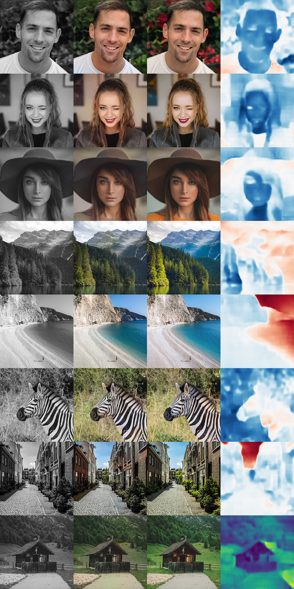

# Kolorování černobílých obrázků pomocí neuronové sítě

Tento projekt se zabývá tématem kolorování černobílých obrázků pomocí neuronové sítě založené na principu autoenkodéru. 

## Dataset
Jako dataset jsem využil celkem 75 000 obrázků, které pocházeli z následujících kategorií:
- Portréty (ženy, muži, děti, herci)
- Krajiny (lesy, pláže, hory, květiny, vodopády, ostrovy)
- Zvířata (zoo, savana)
- Města (budovy, auta, ulice)

Jako augmentaci jsem zvolil vertikální zrcadlení obrázků, což dataset rozšířilo na velikost 150 000 obrázků.

Kvůli výpočetní náročnosti jsem zvolil obrázky o rozměrech 255 x 255 pixelů. 

## Barevný model
Jako barevný model jsem využil model Lab, který obsahuje v jednom kanálu jasovou složku a na neuronové síti je tak odhadnout pouze dva kanály (a,b), které tvoří barevnou složku obrázku.

## Model sítě
Jako model neuronové sítě jsem zvolil síť, která obsahuje pouze konvoluční a dekonvoluční vrstvy. Výrazné zlepšení v oblasti detailů získala síť připojením výstupu z předtrénované sítě Resnet, která slouží jako klasifikátor obrázku.

Celkově síť obsahuje 8 369 615 trénovatelných parametrů. Parametry sítě resnet jsou uzamčeny pro trénování.

## Výsledky

Výsledky závisejí z velké míry na vstupních datech. Velké rozpětí typů obrázků je hlavně u zvířat a portrétů. Pro správné fungování ve všech kategoriích je nutné dataset minimálně o 200 tisíc obrázků rozšířit.

Porovnání obrázků (černobílý, kolorovaný, originál, kanál a):

## Soubory

Přiložené soubory obsahují již natrénovaný model a trénovací script, který umožňuje trénování na více grafický kartách.

Trénování na 8 GPU při 150000 obrázích o rozměru 255x255 trvalo 12 hodin.

